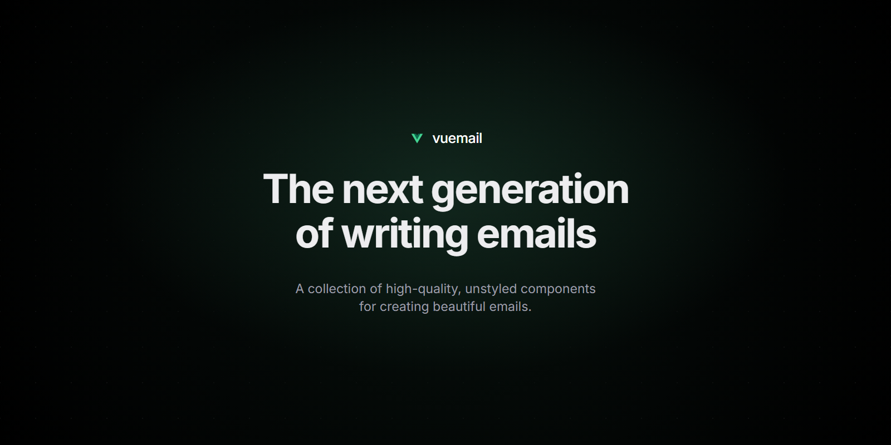

<div align="center"><strong>Vuemail</strong></div>
<div align="center">The next generation of writing emails.<br />High-quality, unstyled components for creating emails with Vue.</div>
<br />
<div align="center">
<a href="https://vuemail.dev">Website</a>
<span> · </span>
<a href="https://github.com/psycarlo/vuemail">GitHub</a>
</div>

## Introduction

A collection of high-quality, unstyled components for creating beautiful emails using Vue and TypeScript.
It reduces the pain of coding responsive emails with dark mode support. It also takes care of inconsistencies between Gmail, Outlook, and other email clients for you.

## Why

We believe that email is an extremely important medium for people to communicate. However, we need to stop developing emails like 2010, and rethink how email can be done in 2026 and beyond. Email development needs a revamp. A renovation. Modernized for the way we build web apps today.

## Install

```sh
npm i vuemail
```

## Getting started

Define your email template as a Vue single file component, include styles and our components where needed.

```vue
<script setup lang="ts">
import { Button } from 'vuemail';
</script>

<template>
  <Button href="https://example.com" :style="{ color: '#42b883' }">
    Click me
  </Button>
</template>
```

## Using with AI

Install the Vuemail skill to teach your coding agent (Claude Code, Codex, Cursor, GitHub Copilot, and others) how to build emails with Vuemail:

```sh
npx skills add psycarlo/vuemail
```

The docs are also available for LLMs at [vuemail.dev/docs/llms.txt](https://vuemail.dev/docs/llms.txt).

## Components

A set of standard components to help you build amazing emails without having to deal with the mess of creating table-based layouts and maintaining archaic markup.

- [Html](https://github.com/psycarlo/vuemail/tree/main/packages/vuemail/src/components/html)
- [Head](https://github.com/psycarlo/vuemail/tree/main/packages/vuemail/src/components/head)
- [Button](https://github.com/psycarlo/vuemail/tree/main/packages/vuemail/src/components/button)
- [Container](https://github.com/psycarlo/vuemail/tree/main/packages/vuemail/src/components/container)
- [CodeBlock](https://github.com/psycarlo/vuemail/tree/main/packages/vuemail/src/components/code-block)
- [CodeInline](https://github.com/psycarlo/vuemail/tree/main/packages/vuemail/src/components/code-inline)
- [Column](https://github.com/psycarlo/vuemail/tree/main/packages/vuemail/src/components/column)
- [Row](https://github.com/psycarlo/vuemail/tree/main/packages/vuemail/src/components/row)
- [Font](https://github.com/psycarlo/vuemail/tree/main/packages/vuemail/src/components/font)
- [Heading](https://github.com/psycarlo/vuemail/tree/main/packages/vuemail/src/components/heading)
- [Divider](https://github.com/psycarlo/vuemail/tree/main/packages/vuemail/src/components/hr)
- [Image](https://github.com/psycarlo/vuemail/tree/main/packages/vuemail/src/components/img)
- [Link](https://github.com/psycarlo/vuemail/tree/main/packages/vuemail/src/components/link)
- [Markdown](https://github.com/psycarlo/vuemail/tree/main/packages/vuemail/src/components/markdown)
- [Preview](https://github.com/psycarlo/vuemail/tree/main/packages/vuemail/src/components/preview)
- [Section](https://github.com/psycarlo/vuemail/tree/main/packages/vuemail/src/components/section)
- [Tailwind](https://github.com/psycarlo/vuemail/tree/main/packages/vuemail/src/components/tailwind)
- [Paragraph](https://github.com/psycarlo/vuemail/tree/main/packages/vuemail/src/components/text)
- [Body](https://github.com/psycarlo/vuemail/tree/main/packages/vuemail/src/components/body)

## Nuxt

Vuemail works with [Nuxt](https://nuxt.com) through the `vuemail-nuxt` module, which lets your server routes import emails written as Vue single file components and render them.

```sh
npm i vuemail vuemail-nuxt
```

```ts
// nuxt.config.ts
export default defineNuxtConfig({
  modules: ['vuemail-nuxt'],
});
```

```ts
// server/api/send.post.ts
import { render } from 'vuemail';
import WelcomeEmail from '~~/emails/welcome.vue';

export default defineEventHandler(async () => {
  const html = await render(WelcomeEmail, { name: 'Ana' });
  // send it with the email service provider of your choice
});
```

See the [module's documentation](https://github.com/psycarlo/vuemail/tree/main/packages/nuxt) for more details.

## Editor

Vuemail also provides an Editor, `vuemail-editor`, built on top of [TipTap](https://tiptap.dev/) and [ProseMirror](https://prosemirror.net/). It serializes to Vuemail components, and exports email-ready HTML and plain text.

See the [Editor documentation](https://vuemail.dev/docs/editor/overview) for more details.

## Integrations

Emails built with Vuemail can be converted into HTML and sent using any email service provider. Here are some examples:

- [Resend](https://github.com/psycarlo/vuemail/tree/main/examples/resend)
- [Nodemailer](https://github.com/psycarlo/vuemail/tree/main/examples/nodemailer)
- [SendGrid](https://github.com/psycarlo/vuemail/tree/main/examples/sendgrid)
- [MailerSend](https://github.com/psycarlo/vuemail/tree/main/examples/mailersend)
- [Mailgun](https://github.com/psycarlo/vuemail/tree/main/examples/mailgun)
- [Postmark](https://github.com/psycarlo/vuemail/tree/main/examples/postmark)
- [AWS SES](https://github.com/psycarlo/vuemail/tree/main/examples/aws-ses)
- [Azure Communication Email](https://github.com/psycarlo/vuemail/tree/main/examples/azure-communication-email)
- [Plunk](https://github.com/psycarlo/vuemail/tree/main/examples/plunk)
- [Scaleway](https://github.com/psycarlo/vuemail/tree/main/examples/scaleway)

## Support

All components were tested using the most popular email clients.

|  |  |  |  |  |  |
| -------------------------------------------------------------------------------------------------- | ------------------------------------------------------------------------------------------------------- | ------------------------------------------------------------------------------------------------------ | ------------------------------------------------------------------------------------------------------------- | ---------------------------------------------------------------------------------------------- | ------------------------------------------------------------------------------------------------------------ |
| Gmail ✔                                                                                           | Apple Mail ✔                                                                                           | Outlook ✔                                                                                             | Yahoo! Mail ✔                                                                                                | HEY ✔                                                                                         | Superhuman ✔                                                                                                |

## Development workflow

1. [Setting up your development environment](https://vuemail.dev/docs/contributing/development-workflow/1-setup)
2. [Running tests](https://vuemail.dev/docs/contributing/development-workflow/2-running-tests)
3. [Linting](https://vuemail.dev/docs/contributing/development-workflow/3-linting)
4. [Building](https://vuemail.dev/docs/contributing/development-workflow/4-building)
5. [Writing documentation](https://vuemail.dev/docs/contributing/development-workflow/5-writing-docs)

## Contributing

- [Contribution Guide](https://vuemail.dev/docs/contributing)

---

Vuemail is a Vue port of [React Email](https://github.com/resend/react-email) by [Resend](https://resend.com). MIT License.
