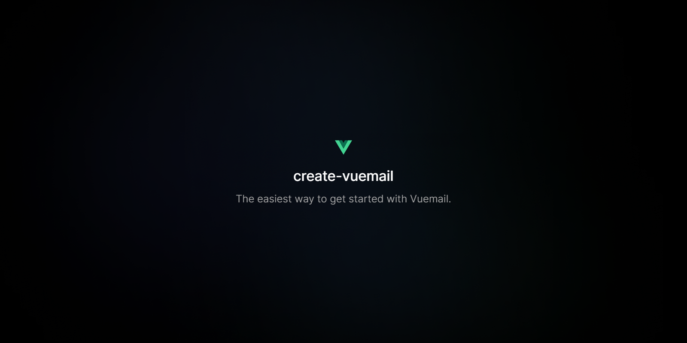

<div align="center"><strong>create-vuemail</strong></div>
<div align="center">The easiest way to get started with Vuemail.</div>
<br />
<div align="center">
<a href="https://vuemail.dev">Website</a>
<span> · </span>
<a href="https://github.com/vuemail/vuemail">GitHub</a>

</div>

## Getting started

To get started, open a new shell and run:

```sh
npx create-vuemail@latest
```

This will create a new folder called `vuemail-starter` with a few email templates.

## Options

Alternatively, you can pass a parameter to specify the name of the folder:

```sh
npx create-vuemail@latest foo
```

## License

MIT License
