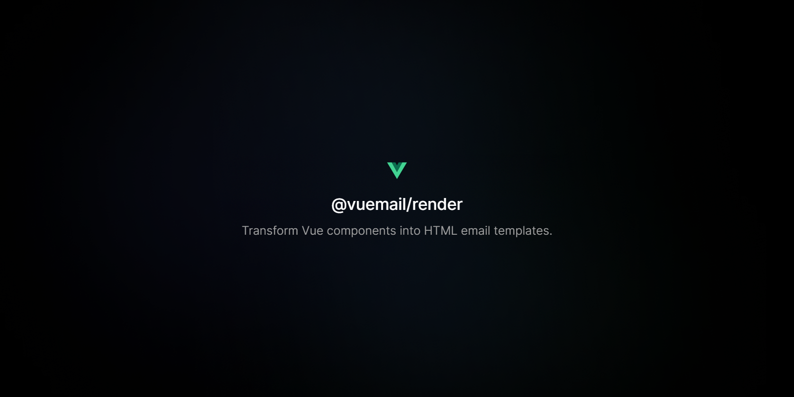

<div align="center"><strong>@vuemail/render</strong></div>
<div align="center">Transform Vue components into HTML email templates.</div>
<br />
<div align="center">
<a href="https://vuemail.dev">Website</a>
<span> · </span>
<a href="https://github.com/psycarlo/vuemail">GitHub</a>

</div>

## Install

Install component from your command line.

#### With yarn

```sh
yarn add @vuemail/render -E
```

#### With npm

```sh
npm install @vuemail/render -E
```

`render` is also exported from [`vuemail`](https://github.com/psycarlo/vuemail/tree/main/packages/vuemail), so you don't need to install this package if you already use it.

## Getting started

Convert Vue components into a HTML string.

```ts
import { render } from '@vuemail/render';
import MyTemplate from '../components/MyTemplate.vue';

const html = await render(MyTemplate, { firstName: 'Jim' });
```

`render` takes the component, its props, and some options, or a VNode and some options:

```ts
import { h } from 'vue';

const html = await render(h(MyTemplate, { firstName: 'Jim' }), { pretty: true });
```

### Options

- `pretty`: formats the HTML
- `plainText`: renders the plain text version of the email instead, customizable with `htmlToTextOptions`, the options of [html-to-text](https://github.com/html-to-text/node-html-to-text)
- `setupApp`: called with the Vue application before it renders, to install the plugins your email depends on, like `vue-i18n`

```ts
import { i18n } from '../i18n';

const text = await render(MyTemplate, { firstName: 'Jim' }, { plainText: true });

const localized = await render(
  MyTemplate,
  { firstName: 'Jim' },
  { setupApp: (app) => app.use(i18n) },
);
```

`pretty` and `toPlainText` are exported too, to format HTML or convert it into plain text.

Importing `.vue` files needs a build step that compiles them, like [Nuxt](https://nuxt.com) with `@vuemail/nuxt`, [Vite](https://vite.dev), or a bundler with a Vue plugin.

## License

MIT License
